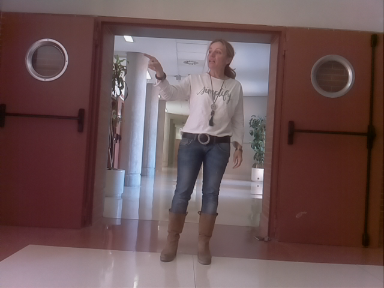
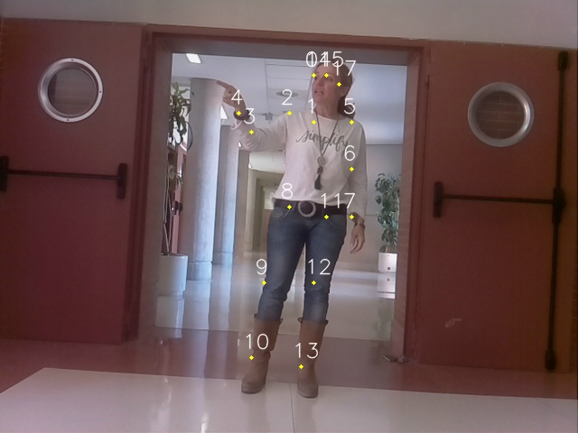
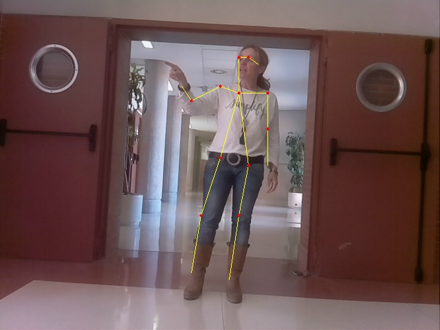

# Introduction en traitement et analyse des images pour des applications de robotique - Détection de la posture d'une personne

## Introduction

Dans ce TP nous allons écrire un algorithme capable de différencer une peronne debout d'une personne assise dans une image.
Pour cela, nous allons exploiter le squelette de la personne présente dans l'image dont la position relatives des jointures va vous permettre
de déterminer dans quelle posture le personne se trouve. Le squelette est extrait grâce à un réseau  de neurones qui a gagné le challenge COCO en 2016.

L'architecture du réseau est la suvante :


et vous trouverez l'article scientifique dans le pdf suivant : 


Le sequelette d'un individu est constitué de 17 jointures et une dernière jointure qui représente le fond de l'image : Nose – 0, Neck – 1, Right Shoulder – 2, Right Elbow – 3,
Right Wrist – 4, Left Shoulder – 5, Left Elbow – 6, Left Wrist – 7, Right Hip – 8, Right Knee – 9, Right Ankle – 10, Left Hip – 11, Left Knee – 12, LAnkle – 13, Right Eye – 14,
Left Eye – 15, Right Ear – 16, Left Ear – 17, Background – 18

Tout comme le TP précédent, vous trouverez les poids du réseau pré-entraîné sur les données de la base COCO au format .caffemodel en suivant ce lien  : https://www.kaggle.com/datasets/changethetuneman/openpose-model/download?datasetVersionNumber=1

Le fichier zip regroupe 5 jeux de poids qui son pour chacun le résultat de l'entraînement après un nombre différent d'itérations.
Vous testerez chacun d'entre eux et vous en choisirez un pour la suite du TP.

**A réaliser** : A vous de produire le script de *testSkeleton.py* sur la base des codes du TP précédent qui permettra d'inférer le réseau pré-entraîné sur une image. Le format de sauvegarde des poids étant le format Caffe vous aurez besoin des deux fichiers .prototxt et le .caffemodel auquel j'ai fait référence précédemmet.

Attention la sortie du réseau après inférence sur une image est une instance de la classe : numpy.ndarray

Par exemple, si je note ```output=net.forward()``` alors ```output[0, i, x, y]``` est le tableau des probabilités que le pixel **(x,y)** de l'image appartienne à la jointure **i**

Donc ```probMap = output[0, i, :, :]``` est l'ensemble des probabilités d'appartenance à la jointure **i** pour tous les pixels de l'image.

Les dimensions de l'image de sortie sont ```H = output.shape[2]``` et ```W = output.shape[3]```. Il faut noter que H et W peuvent être différentes des dimensions de l'image d'entrée sur laquelle vous avez inféré le réseau.

Pour extraire la jointure **i** du squelette de l'individu, il nous faut donc extraire les positions **(x,y)** pour laquelle la probabilité est maximale.
Pour cela nous utilisons la fonction minMaxLoc d'openCV :

```
minVal, prob, minLoc, point = cv2.minMaxLoc(probMap)
```

**A réaliser** : Ainsi vous utiliserez le code suivant pour afficher un cercle en chaque jointure du squelette :

```
points = []

# Dimension que doit avoir l'image d'entrée du réseau
inWidth = 368
inHeight = 368

for i in range(18):
    # Tableau des probabilités pour la jointure i
    probMap = output[0, i, :, :]

    # Le max global des probabilités
    minVal, prob, minLoc, point = cv2.minMaxLoc(probMap)
    
    # Remise à l'échelle car les dimensions des images d'entrée et de sortie sont différentes
    # frameWidth et frameHeight sont les dimensions de l'image d'entrée
    x = (frameWidth * point[0]) / W
    y = (frameHeight * point[1]) / H

    if prob > 0.1 : 
        cv2.circle(frame, (int(x), int(y)), 2, (0, 255, 255), thickness=-1, lineType=cv2.FILLED)
        cv2.putText(frame, "{}".format(i), (int(x)-10, int(y)-10), cv2.FONT_HERSHEY_SIMPLEX, 0.75, (255, 255, 255), 1, lineType=cv2.LINE_AA)

        # Add the point to the list if the probability is greater than the threshold
        points.append((int(x), int(y)))
    else :
        points.append(None)

cv2.imshow('Output-jointures', frame)
cv2.waitKey(0)

```

**A réaliser** : modifier ce code pour relier par paire les jointures. Vous afficherez ces liaisons dans une autre image que vous appellerez output-squelette.

Pour cela vous utiliserez le tableau suivant qui définit les relations entre jointures :
```POSE_PAIRS = [ [1,0],[1,2],[1,5],[2,3],[3,4],[5,6],[6,7],[1,8],[8,9],[9,10],[1,11],[11,12],[12,13],[0,14],[0,15],[14,16],[15,17]]```

**Résultats à obtenir**

Pour l'image **debout.png** vous aurez le résultat **Output-jointures.jpg** et**Output-squelette.jpg**.






## Classification personne debout/personne couchée

Il s'agit désormais de déterminer un processus de décision qui permettra de déterminer si une personne est debout ou couchée.
Cette règle de décision devra être définie en fonction de la position relative des jointures dans l'image.
Pour y parvenir vous utiliserez les images de la base 
